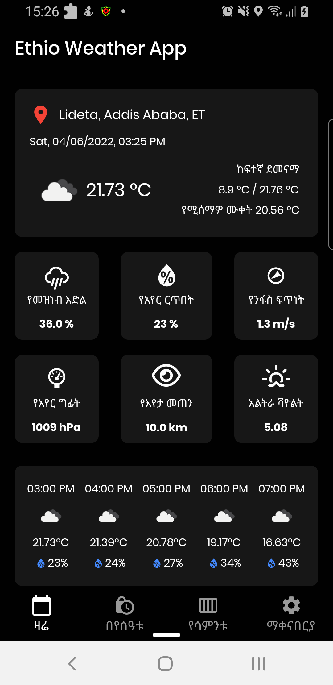
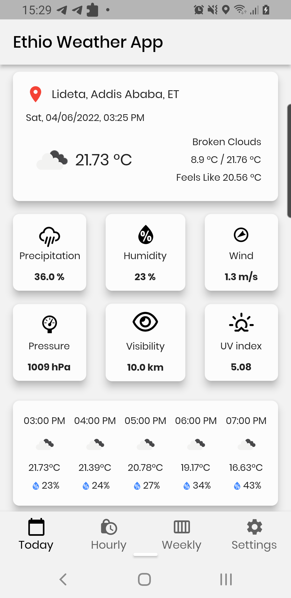
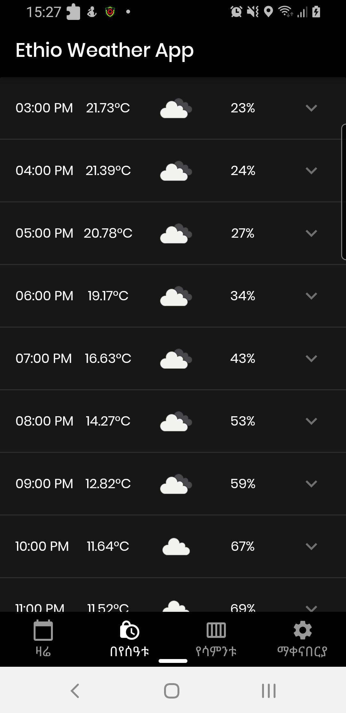
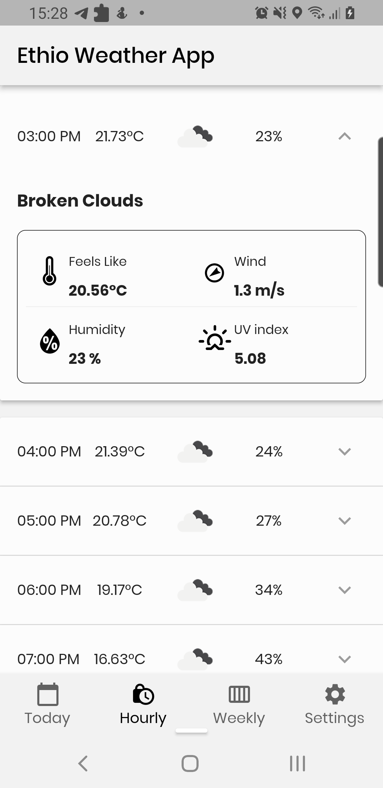
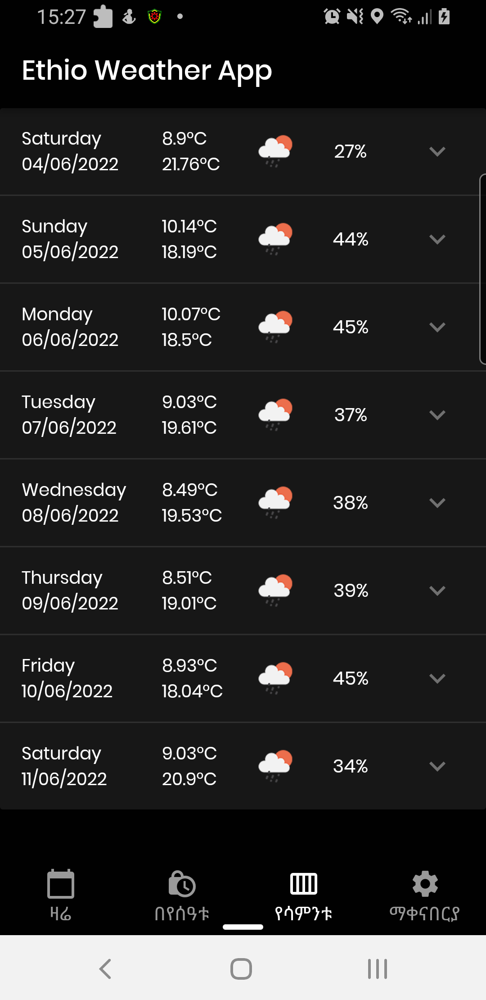
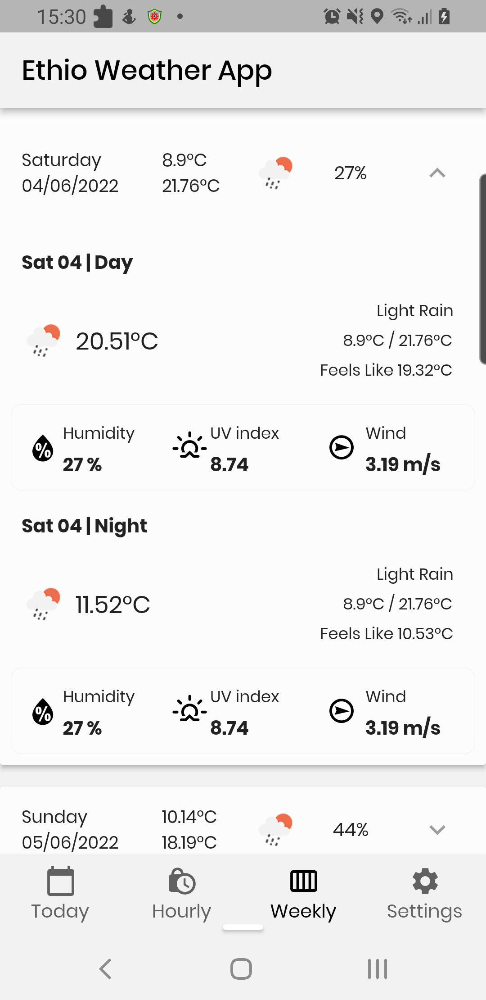
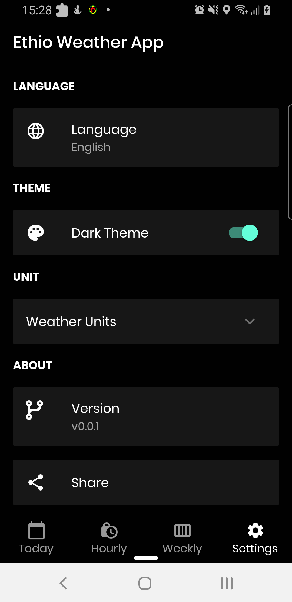
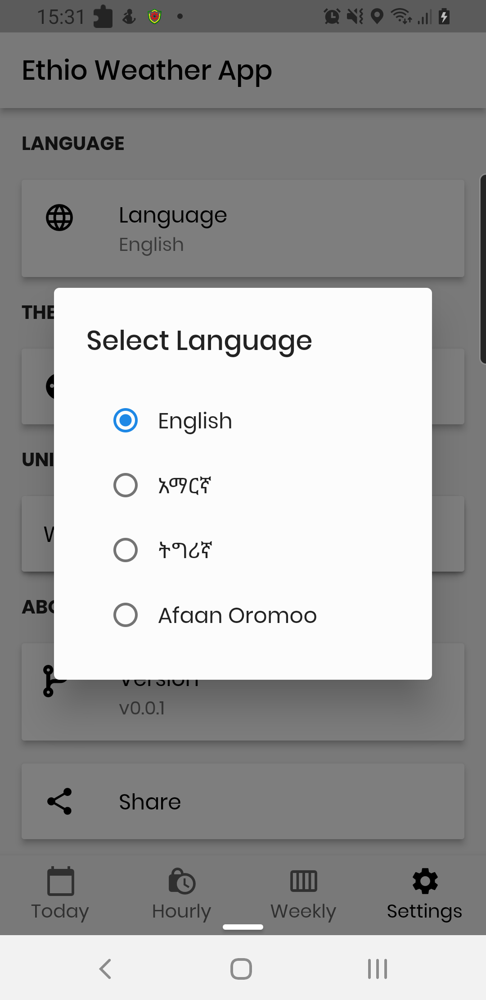

# Ethio Weather Mobile Application 
# ኢትዮ ዌዘር የሞባይል መተግበርያ

Ethiopia Weather application provide weather information.

## Screenshots

Screenshots to the app and experience it before hand.

|       |  |
| ----------- | ----------- |
|  |  |
|  |  |
|  |  |
|  |  |

## Getting Started

Follow these instructions to set up the project locally.

### Prerequisites

*   [Flutter SDK](https://docs.flutter.dev/get-started/install) (version >= 3.38.1 recommended)
*   [Android Studio](https://developer.android.com/studio) or [VS Code](https://code.visualstudio.com/)
*   An [OpenWeatherMap API Key](https://home.openweathermap.org/api_keys) (requires One Call API 3.0 subscription)

### Setup Steps

1.  **Clone the repository:**
    ```bash
    git clone <repository_url>
    cd ethio_weather
    ```

2.  **Configure Environment Variables:**
    Create a file named `.env` in the root directory and add your OpenWeatherMap API key:
    ```env
    OPEN_WEATHER_MAP_APP_ID=your_api_key_here
    ```

3.  **Firebase Configuration:**
    *   Create a Firebase project at [Firebase Console](https://console.firebase.google.com/).
    *   Add an Android app with the package name `com.ethio.weather`.
    *   Download the `google-services.json` file and place it in `android/app/`.

4.  **Install Dependencies:**
    ```bash
    flutter pub get
    ```

5.  **Android Build Configuration:**
    Ensure your Android environment is set up for:
    *   `minSdkVersion`: 24
    *   `compileSdkVersion`: 35
    *   Java 17 compatibility (defined in `android/app/build.gradle`)

6.  **Run the Application:**
    ```bash
    flutter run
    ```

## Features
*   Current weather data and local search.
*   Detailed hourly and weekly forecasts.
*   Background weather alerts and notifications.
*   Support for multiple languages including Amharic.
*   Dynamic Light and Dark mode.
